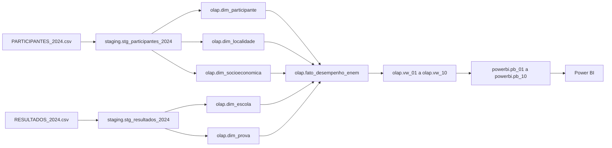
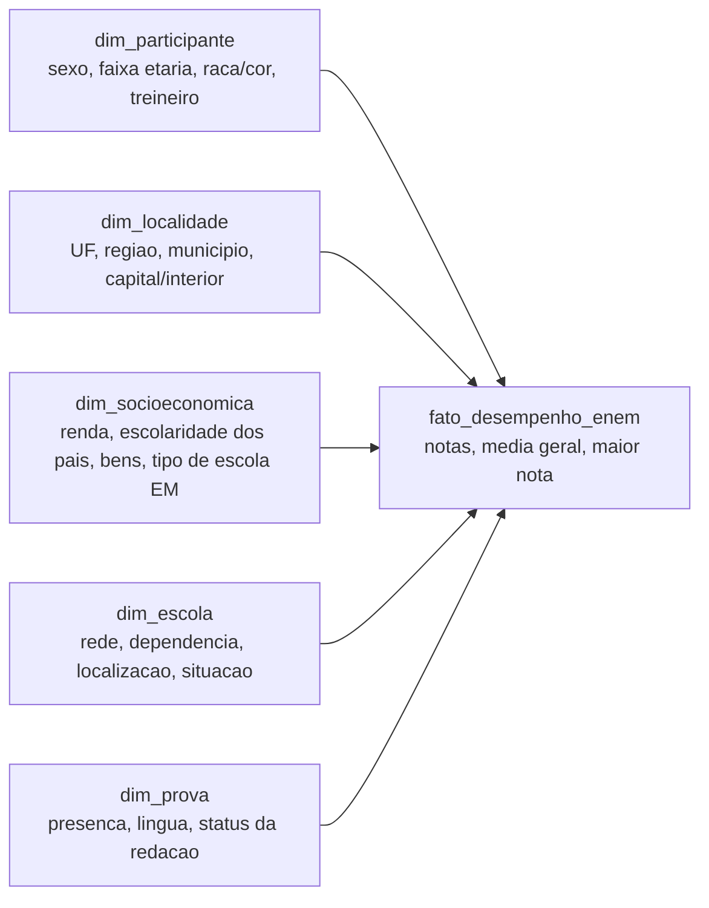
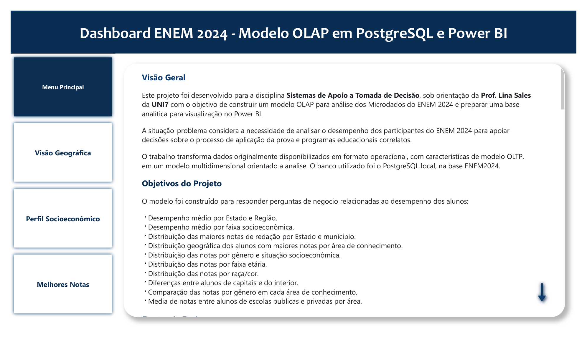
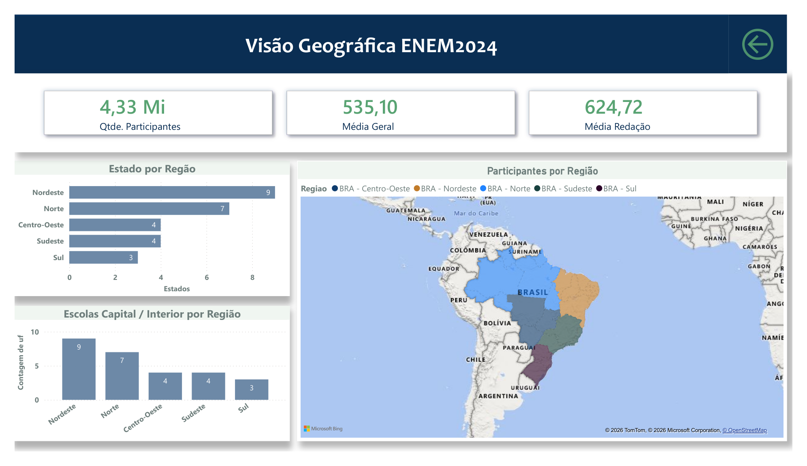
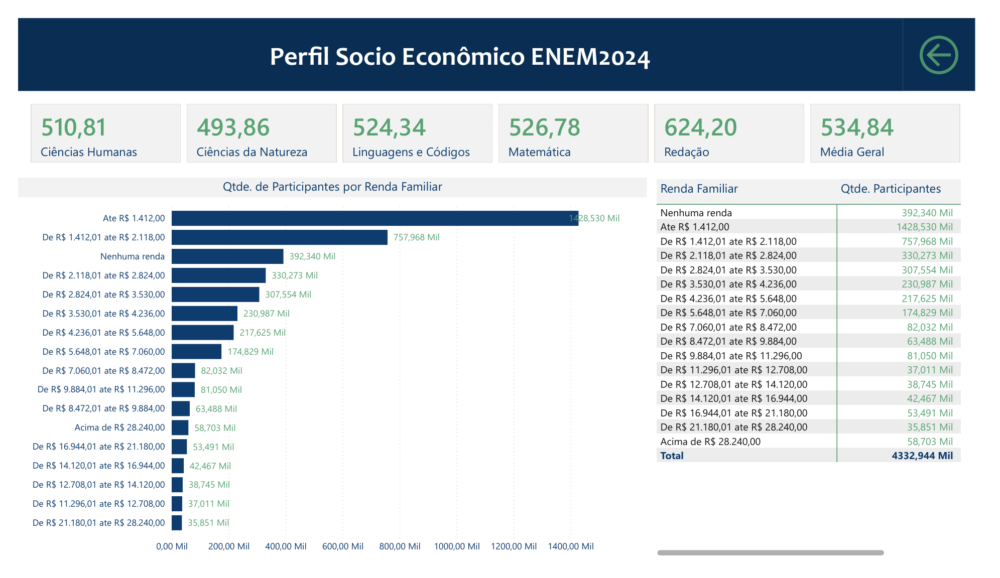
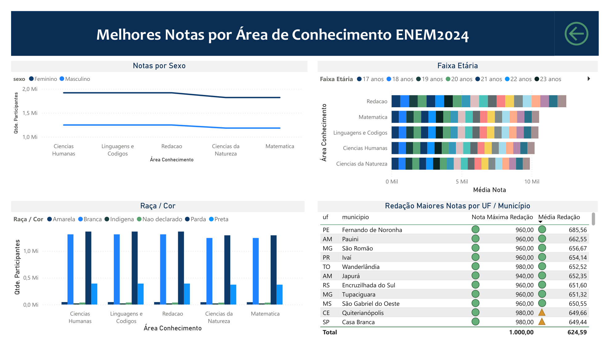
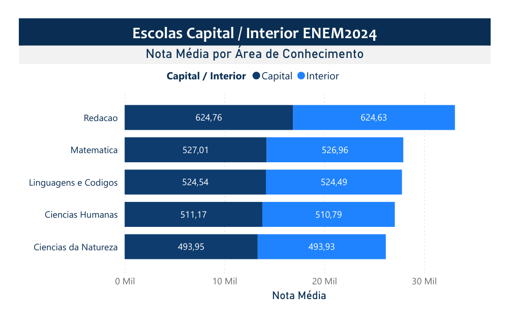
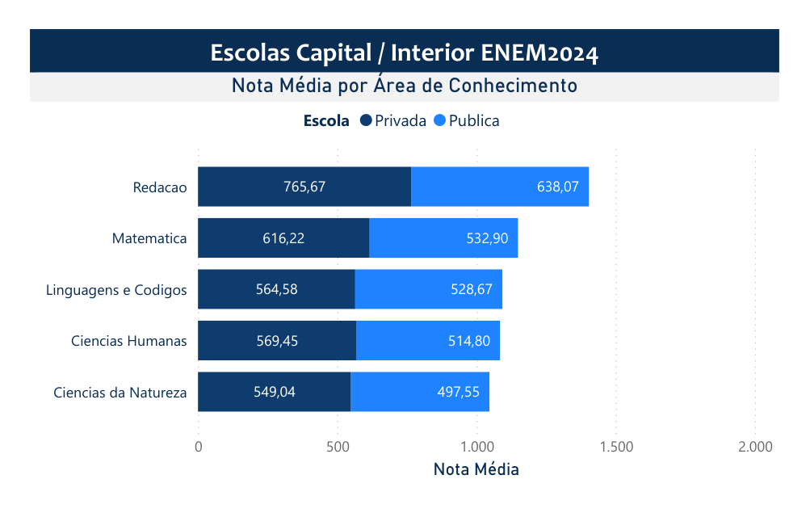
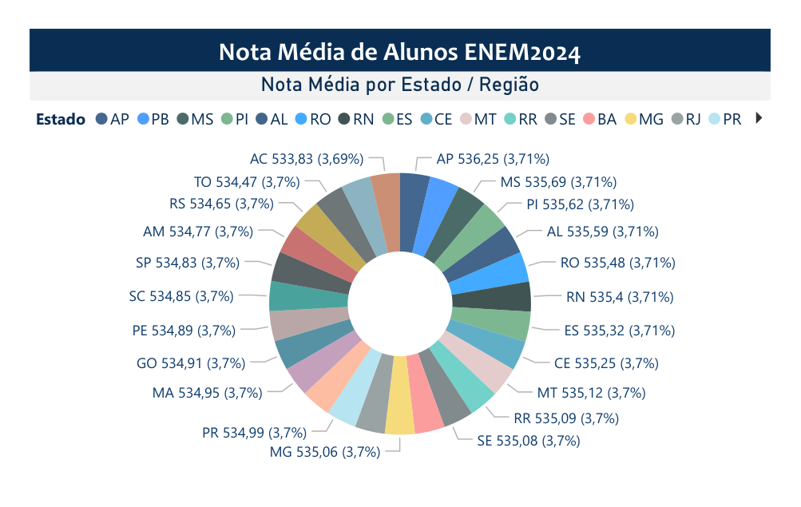

# Dashboard ENEM 2024 - Modelo OLAP em PostgreSQL e Power BI

## Visao Geral

Este projeto foi desenvolvido para a disciplina **Sistemas de Apoio a Tomada de Decisao**, com o objetivo de construir um modelo OLAP para analise dos Microdados do ENEM 2024 e preparar uma base analitica para visualizacao no Power BI.

A situacao-problema considera a necessidade de analisar o desempenho dos participantes do ENEM 2024 para apoiar decisoes sobre o processo de aplicacao da prova e programas educacionais correlatos.

O trabalho transforma dados originalmente disponibilizados em formato operacional, com caracteristicas de modelo OLTP, em um modelo multidimensional orientado a analise. O banco utilizado foi o PostgreSQL local, na base `ENEM2024`.

## Objetivos do Projeto

O modelo foi construido para responder perguntas de negocio relacionadas ao desempenho dos alunos:

- Desempenho medio por Estado e Regiao.
- Desempenho medio por faixa socioeconomica.
- Distribuicao das maiores notas de redacao por Estado e municipio.
- Distribuicao geografica dos alunos com maiores notas por area de conhecimento.
- Distribuicao das notas por genero e situacao socioeconomica.
- Distribuicao das notas por faixa etaria.
- Distribuicao das notas por raca/cor.
- Diferencas entre alunos de capitais e do interior.
- Comparacao das notas por genero em cada area de conhecimento.
- Media de notas entre alunos de escolas publicas e privadas por area.

## Fontes de Dados

Foram utilizados os arquivos dos Microdados do ENEM 2024, localizados em `microdados_enem_2024`.

Arquivos principais:

- `microdados_enem_2024/DADOS/PARTICIPANTES_2024.csv`: dados demograficos, local de prova e questionario socioeconomico.
- `microdados_enem_2024/DADOS/RESULTADOS_2024.csv`: dados de escola, presenca, provas, notas objetivas e redacao.
- `microdados_enem_2024/DADOS/ITENS_PROVA_2024.csv`: metadados de itens da prova, mantidos como referencia.

Arquivos auxiliares usados para interpretacao dos campos:

- `microdados_enem_2024/INPUTS/INPUT_R_PARTICIPANTES_2024.R`
- `microdados_enem_2024/INPUTS/INPUT_R_RESULTADOS_2024.R`
- `microdados_enem_2024/INPUTS/INPUT_SPSS_PARTICIPANTES_2024.sps`
- `microdados_enem_2024/INPUTS/INPUT_SPSS_RESULTADOS_2024.sps`

Esses arquivos auxiliaram na identificacao de codigos, rotulos e tipos de variaveis, como sexo, faixa etaria, raca/cor, renda familiar, tipo de escola, presenca e status da redacao.

## Estrutura do Projeto

```text
AV2-TRABALHO-1-ENEM/
|-- AV2-TRABALHO-1-ENEM.md
|-- README.MD
|-- dashboard_ENEM2024.pdf
|-- docs/
|   |-- MODELO_OLAP_ENEM_2024.md
|   `-- dashboard/
|       |-- 01_menu_principal.png
|       |-- 02_visao_geografica.png
|       |-- 03_perfil_socioeconomico.png
|       |-- 04_melhores_notas.png
|       |-- 05_capital_interior.png
|       |-- 06_escola_publica_privada.png
|       `-- 07_nota_media_estado_regiao.png
|-- microdados_enem_2024/
|   |-- DADOS/
|   |-- INPUTS/
|   `-- PROVAS E GABARITOS/
|-- powerbi/
|   |-- README_POWERBI.md
|   `-- README_POWERBI_versao_anterior.md
`-- sql/
    |-- 00_executar_tudo.sql
    |-- 01_criar_staging.sql
    |-- 02_carregar_staging.sql
    |-- 03_criar_modelo_olap.sql
    |-- 04_criar_views_dashboard.sql
    `-- 05_criar_tabelas_powerbi.sql
```

## Processo de Desenvolvimento

O desenvolvimento seguiu o plano de execucao definido para o projeto:

1. Validacao da estrutura dos CSVs e das variaveis disponiveis.
2. Criacao da area de staging no PostgreSQL.
3. Carga dos arquivos `PARTICIPANTES_2024.csv` e `RESULTADOS_2024.csv`.
4. Criacao do modelo estrela no schema `olap`.
5. Criacao de views analiticas para responder as perguntas do dashboard.
6. Criacao de uma camada fisica agregada no schema `powerbi`, para importacao estavel no Power BI.
7. Construcao do dashboard no Power BI Desktop e exportacao das paginas em `dashboard_ENEM2024.pdf`.
8. Documentacao do processo, das justificativas, dos visuais e dos insights obtidos.

## Arquitetura dos Dados

O projeto usa tres camadas logicas no PostgreSQL:

- `staging`: recebe os dados brutos dos CSVs, preservando os codigos originais do INEP.
- `olap`: contem o modelo multidimensional, com dimensoes, fato e views analiticas.
- `powerbi`: contem tabelas fisicas agregadas, criadas para reduzir o volume importado pelo Power BI.

### Fluxo Geral



### Modelo Estrela Proposto



## Modelo OLAP

### Tabela Fato

`olap.fato_desempenho_enem`

Grao da tabela: uma linha por participante carregado e pareado com o arquivo de resultados.

Medidas principais:

- `nota_cn`: nota de Ciencias da Natureza.
- `nota_ch`: nota de Ciencias Humanas.
- `nota_lc`: nota de Linguagens e Codigos.
- `nota_mt`: nota de Matematica.
- `nota_redacao`: nota de redacao.
- `media_geral`: media das notas disponiveis.
- `maior_nota`: maior nota entre as areas.
- `area_maior_nota`: area correspondente a maior nota.
- `indicador_presenca_completa`: indica se o participante esteve presente em todas as provas objetivas.
- `qtd_participantes`: medida contadora para agregacoes.

### Dimensoes

`olap.dim_participante`

Contem atributos demograficos e escolares do participante:

- faixa etaria;
- sexo;
- estado civil;
- cor/raca;
- nacionalidade;
- situacao de conclusao do Ensino Medio;
- tipo de ensino;
- indicador de treineiro.

`olap.dim_localidade`

Contem informacoes geograficas da aplicacao da prova:

- codigo e nome do municipio;
- codigo e sigla da UF;
- regiao;
- classificacao entre capital e interior.

`olap.dim_socioeconomica`

Contem atributos do questionario socioeconomico:

- escolaridade do pai e da mae;
- ocupacao do pai e da mae;
- quantidade de pessoas na residencia;
- renda familiar;
- faixa socioeconomica derivada;
- tipo de escola frequentada no Ensino Medio;
- bens e servicos domiciliares.

`olap.dim_escola`

Contem caracteristicas da escola:

- codigo da escola;
- municipio e UF;
- dependencia administrativa;
- rede publica/privada;
- localizacao urbana/rural;
- situacao de funcionamento.

`olap.dim_prova`

Contem caracteristicas da realizacao da prova:

- presenca por area;
- codigo das provas;
- lingua estrangeira;
- status da redacao.

## Justificativas das Escolhas

O modelo estrela foi escolhido porque e o formato mais adequado para ferramentas de BI. Ele separa medidas numericas, armazenadas na tabela fato, dos atributos descritivos, armazenados nas dimensoes. Isso facilita consultas por UF, regiao, renda, genero, faixa etaria, raca/cor e tipo de escola.

A area de staging foi criada para preservar os dados originais do INEP. Essa escolha permite recarregar os dados, auditar transformacoes e comparar o dado bruto com o dado tratado.

Os campos foram carregados inicialmente como texto no staging. Essa abordagem evita falhas de importacao causadas por campos vazios, separadores decimais ou codigos categoricos. A conversao para tipos numericos ocorre apenas na etapa OLAP.

O arquivo `RESULTADOS_2024.csv` nao possui `NU_INSCRICAO`; ele possui `NU_SEQUENCIAL`. Por isso, o relacionamento entre participantes e resultados foi feito usando uma chave tecnica `id_carga`, gerada pela ordem de carga dos participantes, pareada com `NU_SEQUENCIAL`. Essa solucao preserva o pareamento quando os CSVs originais sao carregados sem reordenacao.

A dimensao socioeconomica foi inicialmente planejada como uma dimensao com combinacoes distintas de respostas. Durante a execucao, verificou-se alta cardinalidade, o que tornava a criacao da fato muito lenta. A solucao adotada foi usar `id_carga` como chave tecnica para essa dimensao, mantendo os atributos analiticos e reduzindo o custo de processamento.

Tambem foram criadas chaves hash para dimensoes de localidade, escola e prova. Essa decisao reduziu joins por multiplas colunas e acelerou a criacao da tabela fato.

Por fim, foi criada uma camada adicional no schema `powerbi`. Essa camada materializa consultas agregadas em tabelas fisicas, evitando que o Power BI tente executar views pesadas durante a importacao.

## Scripts SQL

`sql/00_executar_tudo.sql`

Executa o fluxo completo de criacao do staging, carga, modelo OLAP e views.

`sql/01_criar_staging.sql`

Cria as tabelas brutas:

- `staging.stg_participantes_2024`
- `staging.stg_resultados_2024`

`sql/02_carregar_staging.sql`

Carrega os CSVs originais usando `\copy` do `psql`.

`sql/03_criar_modelo_olap.sql`

Cria as dimensoes e a tabela fato no schema `olap`.

`sql/04_criar_views_dashboard.sql`

Cria as views analiticas para responder as perguntas do trabalho.

`sql/05_criar_tabelas_powerbi.sql`

Cria tabelas fisicas agregadas no schema `powerbi`, recomendadas para importacao no Power BI.

## Views Analiticas

As views do schema `olap` foram criadas para mapear diretamente as perguntas do enunciado:

- `olap.vw_01_desempenho_estado_regiao`: desempenho medio por Estado e Regiao.
- `olap.vw_02_desempenho_faixa_socioeconomica`: desempenho por faixa socioeconomica.
- `olap.vw_03_maiores_redacoes_localidade`: maiores notas de redacao por Estado e municipio.
- `olap.vw_04_maiores_notas_area_geografica`: maiores notas por area de conhecimento e localidade.
- `olap.vw_05_notas_genero_socioeconomica`: notas por genero e situacao socioeconomica.
- `olap.vw_06_notas_faixa_etaria`: notas por faixa etaria.
- `olap.vw_07_notas_raca_cor`: notas por raca/cor.
- `olap.vw_08_capital_interior`: comparacao entre capital e interior.
- `olap.vw_09_genero_por_area`: notas por genero em cada area.
- `olap.vw_10_rede_escola_por_area`: medias por escola publica e privada.

## Camada Power BI

Durante a importacao no Power BI, foi identificado erro de ODBC/OLE DB ao carregar muitas views e tabelas grandes simultaneamente. Para resolver isso, foram criadas tabelas agregadas no schema `powerbi`.

Tabelas recomendadas para importar no Power BI:

- `powerbi.pb_01_desempenho_estado_regiao`
- `powerbi.pb_02_desempenho_faixa_socioeconomica`
- `powerbi.pb_03_top_redacoes_localidade`
- `powerbi.pb_04_top_notas_area_geografica`
- `powerbi.pb_05_notas_genero_socioeconomica`
- `powerbi.pb_06_notas_faixa_etaria`
- `powerbi.pb_07_notas_raca_cor`
- `powerbi.pb_08_capital_interior`
- `powerbi.pb_09_genero_por_area`
- `powerbi.pb_10_rede_escola_por_area`

Essas tabelas ja consolidam as agregacoes necessarias para o dashboard e reduzem significativamente o volume importado.

## Conexao no Power BI

Configuracao usada:

- Servidor: `localhost`
- Banco de dados: `ENEM2024`
- Modo de conectividade: `Importar`

Para um dashboard mais leve, recomenda-se importar somente as tabelas do schema `powerbi`.

A versao anterior da orientacao, baseada no schema `olap`, esta em `powerbi/README_POWERBI_versao_anterior.md`. Ela foi preservada porque descreve o modelo estrela completo e os relacionamentos entre fato e dimensoes.

## Dashboard ENEM 2024 (Power BI)

O dashboard foi construido no Power BI Desktop e exportado em `dashboard_ENEM2024.pdf`. As capturas de tela de cada pagina estao em `docs/dashboard/` para consulta no repositorio e neste README.

Arquivo do projeto no Power BI: `powerbi/AV2_ENEM2024_TRB1.pbix` (versionado no repositorio via Git LFS).

O dashboard possui menu de navegacao com tres paginas analiticas principais, alem de visuais complementares para comparacao por localidade e rede escolar.

### Menu principal

Pagina inicial com visao geral do trabalho, objetivos das 10 perguntas de negocio e botoes de navegacao para as demais paginas.



### Pagina 1 — Visao Geografica

Fonte: `powerbi.pb_01_desempenho_estado_regiao` e `powerbi.pb_08_capital_interior`.

Visuais implementados:

- Cartoes: quantidade de participantes (4,33 Mi), media geral (535,10) e media de redacao (624,72).
- Mapa do Brasil por UF com intensidade de desempenho.
- Grafico de barras: estados por regiao.
- Grafico de barras: participantes por regiao.
- Grafico de barras: escolas em capital versus interior por regiao.

Perguntas atendidas:

| # | Pergunta |
|---|----------|
| 1 | Desempenho medio por Estado e Regiao |
| 8 | Diferencas entre alunos de capitais e do interior (visao por regiao) |



### Pagina 2 — Perfil Socioeconomico

Fonte: `powerbi.pb_02_desempenho_faixa_socioeconomica`.

Visuais implementados:

- Grafico de barras e tabela: quantidade de participantes por renda familiar.
- Cartoes com media por area de conhecimento (Ciencias Humanas, Ciencias da Natureza, Linguagens e Codigos, Matematica, Redacao) e media geral.

Pergunta atendida:

| # | Pergunta |
|---|----------|
| 2 | Desempenho medio por faixa socioeconomica |



### Pagina 3 — Melhores Notas

Fontes: `powerbi.pb_03_top_redacoes_localidade`, `powerbi.pb_04_top_notas_area_geografica`, `powerbi.pb_05_notas_genero_socioeconomica`, `powerbi.pb_06_notas_faixa_etaria`, `powerbi.pb_07_notas_raca_cor`, `powerbi.pb_09_genero_por_area`.

Visuais implementados:

- Painel: melhores notas por area de conhecimento.
- Tabela: maiores notas de redacao por UF e municipio (nota maxima e media de redacao).
- Grafico de barras empilhadas: quantidade de participantes por sexo e area de conhecimento.
- Grafico de barras empilhadas: quantidade de participantes por raca/cor e area de conhecimento.
- Grafico de barras: media de nota por faixa etaria e area de conhecimento.

Perguntas atendidas:

| # | Pergunta |
|---|----------|
| 3 | Distribuicao das maiores notas de redacao por Estado e municipio |
| 4 | Distribuicao geografica dos alunos com maiores notas por area de conhecimento |
| 5 | Distribuicao das notas por genero e situacao socioeconomica |
| 6 | Distribuicao das notas por faixa etaria |
| 7 | Distribuicao das notas por raca/cor |
| 9 | Comparacao das notas por genero em cada area de conhecimento |



### Visuais complementares — Capital, Interior e Rede Escolar

Fontes: `powerbi.pb_08_capital_interior`, `powerbi.pb_10_rede_escola_por_area`, `powerbi.pb_01_desempenho_estado_regiao`.

#### Capital versus Interior

Grafico de barras agrupadas: nota media por area de conhecimento, comparando capital e interior.

| # | Pergunta |
|---|----------|
| 8 | Diferencas entre alunos de capitais e do interior |



#### Escola publica versus privada

Grafico de barras agrupadas: nota media por area de conhecimento, comparando rede publica e privada.

| # | Pergunta |
|---|----------|
| 10 | Media de notas entre alunos de escolas publicas e privadas por area |



#### Nota media por Estado e Regiao

Visual de treemap (ou mapa de arvore) com nota media por UF, incluindo percentual de participacao por estado.

| # | Pergunta |
|---|----------|
| 1 | Desempenho medio por Estado e Regiao (detalhamento por UF) |



### Resumo: perguntas x paginas do dashboard

| Pergunta | Pagina / visual principal |
|----------|---------------------------|
| 1. Desempenho por Estado e Regiao | Visao Geografica; Nota media por UF |
| 2. Desempenho por faixa socioeconomica | Perfil Socioeconomico |
| 3. Maiores notas de redacao | Melhores Notas (tabela UF/municipio) |
| 4. Maiores notas por area e geografia | Melhores Notas (painel por area) |
| 5. Notas por genero e socioeconomia | Melhores Notas (sexo x area) |
| 6. Notas por faixa etaria | Melhores Notas (faixa etaria) |
| 7. Notas por raca/cor | Melhores Notas (raca/cor) |
| 8. Capital versus interior | Visao Geografica; visual Capital/Interior |
| 9. Genero por area de conhecimento | Melhores Notas (sexo x area) |
| 10. Escola publica versus privada | Visual rede publica/privada |

Documentacao detalhada de conexao e medidas DAX: `powerbi/README_POWERBI.md`.

## Resultados da Execucao

A carga e transformacao foram executadas com sucesso no PostgreSQL.

Contagens principais:

- `staging.stg_participantes_2024`: 4.332.944 registros.
- `staging.stg_resultados_2024`: 4.332.944 registros.
- `olap.dim_participante`: 4.332.944 registros.
- `olap.dim_localidade`: 1.753 registros.
- `olap.dim_socioeconomica`: 4.332.944 registros.
- `olap.dim_escola`: 29.401 registros.
- `olap.dim_prova`: 382 registros.
- `olap.fato_desempenho_enem`: 4.332.944 registros.

Tabelas agregadas criadas para Power BI:

- `powerbi.pb_01_desempenho_estado_regiao`: 27 registros.
- `powerbi.pb_02_desempenho_faixa_socioeconomica`: 17 registros.
- `powerbi.pb_03_top_redacoes_localidade`: 37.575 registros.
- `powerbi.pb_04_top_notas_area_geografica`: 6.423 registros.
- `powerbi.pb_05_notas_genero_socioeconomica`: 170 registros.
- `powerbi.pb_06_notas_faixa_etaria`: 100 registros.
- `powerbi.pb_07_notas_raca_cor`: 30 registros.
- `powerbi.pb_08_capital_interior`: 265 registros.
- `powerbi.pb_09_genero_por_area`: 10 registros.
- `powerbi.pb_10_rede_escola_por_area`: 25 registros.

## Insights Obtidos

As analises agregadas indicam alguns pontos relevantes para exploracao no dashboard.

Por regiao, as medias gerais ficaram muito proximas, com pequena vantagem para Nordeste, Sudeste e Centro-Oeste nas agregacoes estaduais analisadas. Isso sugere que a diferenca regional existe, mas deve ser analisada com filtros por UF, municipio e perfil do participante para evitar conclusoes simplificadas.

As maiores medias gerais por UF, entre os destaques observados, apareceram em:

- Amapa (`AP`): media geral de 536,25.
- Paraiba (`PB`): media geral de 536,24.
- Mato Grosso do Sul (`MS`): media geral de 535,69.
- Piaui (`PI`): media geral de 535,62.
- Alagoas (`AL`): media geral de 535,59.

Na analise por area de conhecimento, Redacao apresentou a maior media agregada entre as areas, seguida por Matematica, Linguagens e Codigos, Ciencias Humanas e Ciencias da Natureza. Esse resultado indica que as areas objetivas devem ser analisadas separadamente, pois possuem escalas e distribuicoes diferentes.

Foram identificadas notas maximas de redacao (`1000`) em diferentes municipios, como Salvador, Itabuna, Vitoria, Paraopeba, Arcoverde, Jaboatao dos Guararapes, Pinhao, Tramandai e Paulinia. Isso permite construir um ranking geografico de alto desempenho em redacao.

Na comparacao capital versus interior, as medias ficaram muito proximas, com pequena vantagem para capitais. Esse insight deve ser explorado por area de conhecimento, pois a diferenca pode ser mais visivel em algumas disciplinas do que na media geral.

Na comparacao por rede escolar, a rede privada apresentou media agregada superior a rede publica. Esse resultado reforca a importancia de cruzar desempenho com variaveis socioeconomicas, renda familiar e tipo de escola frequentada no Ensino Medio.

As faixas socioeconomicas apresentaram medias proximas nas agregacoes gerais. Ainda assim, o dashboard permite analisar a renda familiar em mais detalhe, principalmente quando combinada com genero, raca/cor, UF e tipo de escola.

## Como Executar

No terminal PowerShell, a partir da raiz do projeto:

```powershell
$env:PGPASSWORD="SUA_SENHA_DO_POSTGRES"
& "I:\PostgreSQL\17\pgAdmin 4\runtime\psql.exe" -h localhost -d ENEM2024 -U postgres -f "sql/00_executar_tudo.sql"
& "I:\PostgreSQL\17\pgAdmin 4\runtime\psql.exe" -h localhost -d ENEM2024 -U postgres -f "sql/05_criar_tabelas_powerbi.sql"
Remove-Item Env:PGPASSWORD
```

Se o `psql.exe` estiver no PATH do Windows, tambem e possivel executar:

```powershell
psql -h localhost -d ENEM2024 -U postgres -f sql/00_executar_tudo.sql
psql -h localhost -d ENEM2024 -U postgres -f sql/05_criar_tabelas_powerbi.sql
```

## Observacoes Finais

O modelo OLAP completo fica disponivel no schema `olap`, enquanto a camada recomendada para importacao no Power BI fica no schema `powerbi`.

Para desenvolvimento e auditoria, o schema `olap` e mais completo. Para construcao do dashboard, o schema `powerbi` e mais eficiente, pois evita timeout e erros de importacao ao trabalhar com milhoes de registros.

O projeto esta pronto para ser versionado no GitHub, mantendo os scripts SQL, documentacao e orientacoes de uso. Os arquivos de microdados devem ser avaliados antes do versionamento por causa do tamanho e da origem publica dos dados.

