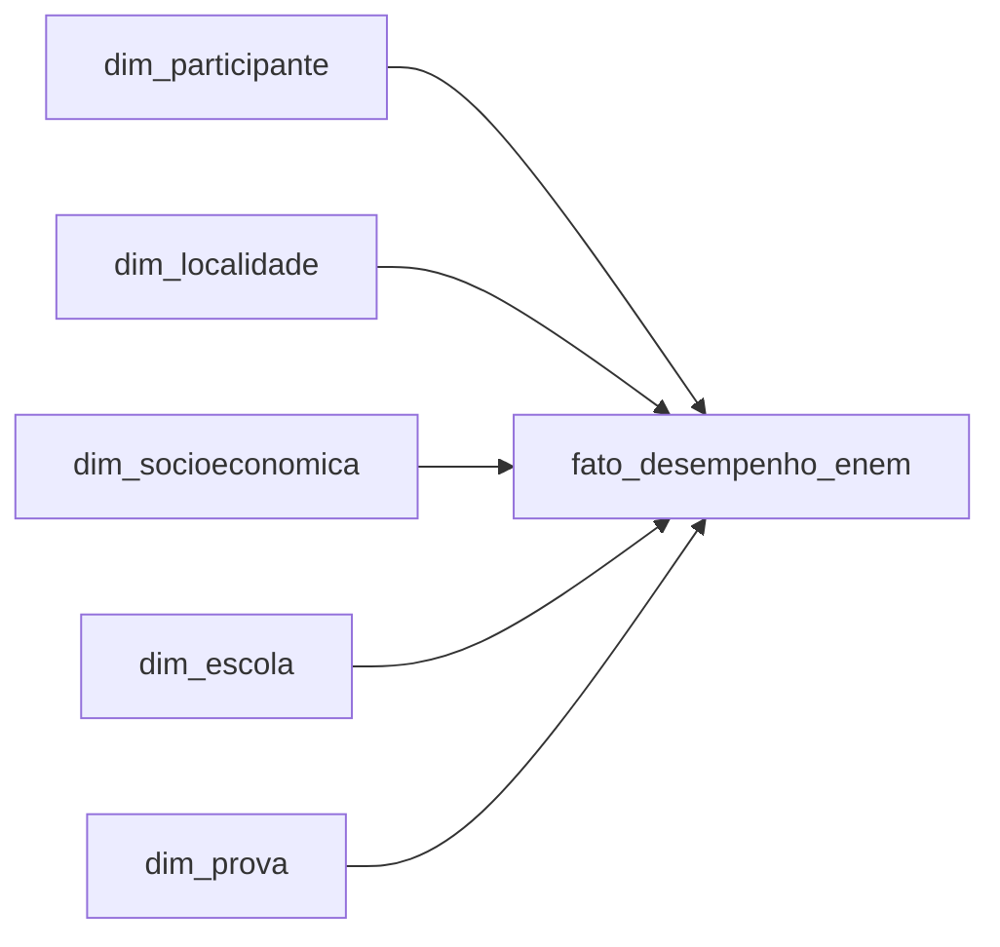

# Modelo OLAP para Analise dos Microdados ENEM 2024

## Contexto

O objetivo deste trabalho e transformar os Microdados do ENEM 2024, originalmente disponibilizados em formato operacional, em um modelo multidimensional para analise no Power BI. O modelo foi implementado para responder perguntas sobre desempenho dos participantes por localizacao geografica, perfil socioeconomico, genero, faixa etaria, raca/cor e tipo de escola.

O banco de dados considerado para a implementacao e o PostgreSQL local, base `ENEM2024`.

## Fontes de Dados

Foram usados os arquivos disponibilizados pelo INEP na pasta `microdados_enem_2024`:

- `DADOS/PARTICIPANTES_2024.csv`: dados cadastrais, demograficos, local de prova e questionario socioeconomico.
- `DADOS/RESULTADOS_2024.csv`: dados de escola, presenca, provas, notas objetivas e redacao.
- `INPUTS/INPUT_R_PARTICIPANTES_2024.R` e `INPUTS/INPUT_R_RESULTADOS_2024.R`: referencia para interpretacao dos codigos.
- `INPUTS/INPUT_SPSS_PARTICIPANTES_2024.sps` e `INPUTS/INPUT_SPSS_RESULTADOS_2024.sps`: referencia complementar de variaveis, tipos e rotulos.

Uma decisao importante foi preservar os dados brutos na area de staging antes de transforma-los. Isso facilita auditoria, recarga e conferencias futuras.

## Processo de Desenvolvimento

O processo foi dividido em quatro etapas:

1. Criacao da area de staging no schema `staging`.
2. Carga dos arquivos CSV originais para tabelas brutas.
3. Transformacao dos dados para o schema estrela no schema `olap`.
4. Criacao de views analiticas para consumo pelo Power BI.

Os scripts foram organizados da seguinte forma:

- `sql/00_executar_tudo.sql`: executa a carga completa.
- `sql/01_criar_staging.sql`: cria as tabelas brutas.
- `sql/02_carregar_staging.sql`: carrega os CSVs originais.
- `sql/03_criar_modelo_olap.sql`: cria dimensoes e fato.
- `sql/04_criar_views_dashboard.sql`: cria views para as perguntas do dashboard.

## Modelo Multidimensional

O modelo segue o formato estrela, com uma tabela fato central e dimensoes descritivas ao redor.



### Tabela Fato

`olap.fato_desempenho_enem`

Grao: uma linha por participante/inscricao carregada e pareada com o arquivo de resultados.

Principais medidas:

- `nota_cn`: nota de Ciencias da Natureza.
- `nota_ch`: nota de Ciencias Humanas.
- `nota_lc`: nota de Linguagens e Codigos.
- `nota_mt`: nota de Matematica.
- `nota_redacao`: nota da redacao.
- `media_geral`: media das notas disponiveis do participante.
- `maior_nota`: maior nota obtida entre as areas.
- `qtd_participantes`: contador para agregacoes.

### Dimensoes

`olap.dim_participante`

Contem atributos demograficos e escolares do participante:

- faixa etaria;
- sexo;
- estado civil;
- cor/raca;
- nacionalidade;
- situacao de conclusao do Ensino Medio;
- tipo de ensino;
- indicador de treineiro.

`olap.dim_localidade`

Contem a localizacao da aplicacao da prova:

- municipio;
- UF;
- regiao;
- classificacao capital/interior.

`olap.dim_socioeconomica`

Contem as respostas do questionario socioeconomico:

- escolaridade dos pais;
- ocupacao dos pais;
- quantidade de pessoas na residencia;
- renda familiar;
- faixa socioeconomica derivada;
- tipo de escola frequentada no Ensino Medio;
- bens e servicos domiciliares selecionados.

`olap.dim_escola`

Contem atributos da escola associada ao participante:

- codigo da escola;
- municipio e UF;
- dependencia administrativa;
- rede publica/privada;
- localizacao urbana/rural;
- situacao de funcionamento.

`olap.dim_prova`

Contem informacoes sobre presenca, provas e redacao:

- presenca por area;
- codigos de prova;
- lingua estrangeira;
- status da redacao.

## Justificativas das Escolhas

O schema estrela foi escolhido por ser adequado a ferramentas de BI, especialmente Power BI, pois reduz a complexidade das consultas e permite agregacoes rapidas por diferentes dimensoes.

A tabela fato concentra as medidas numericas de desempenho, enquanto as dimensoes concentram atributos de analise. Essa separacao facilita perguntas como "qual a media por UF?", "como a renda influencia as notas?" e "qual a diferenca entre escolas publicas e privadas?".

Os dados foram carregados inicialmente como texto no staging para evitar perda de informacao durante a importacao. A conversao para tipos numericos ocorre na transformacao OLAP, onde as regras ficam explicitas e auditaveis.

O arquivo `RESULTADOS_2024.csv` nao possui `NU_INSCRICAO`; ele possui `NU_SEQUENCIAL`. Por isso, o modelo usa a ordem de carga do arquivo `PARTICIPANTES_2024.csv`, representada por `id_carga`, para parear com `NU_SEQUENCIAL`. Essa regra deve ser mantida executando a carga sem reordenar os arquivos originais.

## Views Analiticas

As views criadas no schema `olap` apoiam diretamente as perguntas do enunciado:

- `vw_01_desempenho_estado_regiao`: desempenho medio por estado e regiao.
- `vw_02_desempenho_faixa_socioeconomica`: desempenho por faixa socioeconomica e renda.
- `vw_03_maiores_redacoes_localidade`: maiores notas de redacao por estado e municipio.
- `vw_04_maiores_notas_area_geografica`: maiores notas por area de conhecimento e localidade.
- `vw_05_notas_genero_socioeconomica`: notas por genero e situacao socioeconomica.
- `vw_06_notas_faixa_etaria`: notas por faixa etaria.
- `vw_07_notas_raca_cor`: notas por raca/cor.
- `vw_08_capital_interior`: comparacao entre capitais e interior.
- `vw_09_genero_por_area`: comparacao por genero em cada area de conhecimento.
- `vw_10_rede_escola_por_area`: medias por escola publica/privada e area.

## Insights Esperados

Com o modelo e o dashboard, espera-se identificar:

- diferencas regionais de desempenho, com comparacao entre estados e regioes;
- relacao entre renda familiar e desempenho medio;
- municipios e estados com maiores notas de redacao;
- concentracao geografica das maiores notas por area de conhecimento;
- variacoes de desempenho por genero, faixa etaria e raca/cor;
- diferenca entre participantes de capitais e do interior;
- diferenca de medias entre redes publica e privada.

Esses resultados podem apoiar decisoes sobre politicas educacionais, priorizacao regional, programas de apoio socioeconomico e acompanhamento de desigualdades no acesso ao desempenho escolar.

## Como Executar

No terminal, a partir da raiz do projeto:

```powershell
psql -h localhost -d ENEM2024 -U postgres -f sql/00_executar_tudo.sql
```

Caso seu usuario do PostgreSQL nao seja `postgres`, substitua o valor de `-U`.

Depois da execucao, conecte o Power BI ao banco `ENEM2024` e importe o schema `olap`, seguindo o guia em `powerbi/README_POWERBI.md`.

