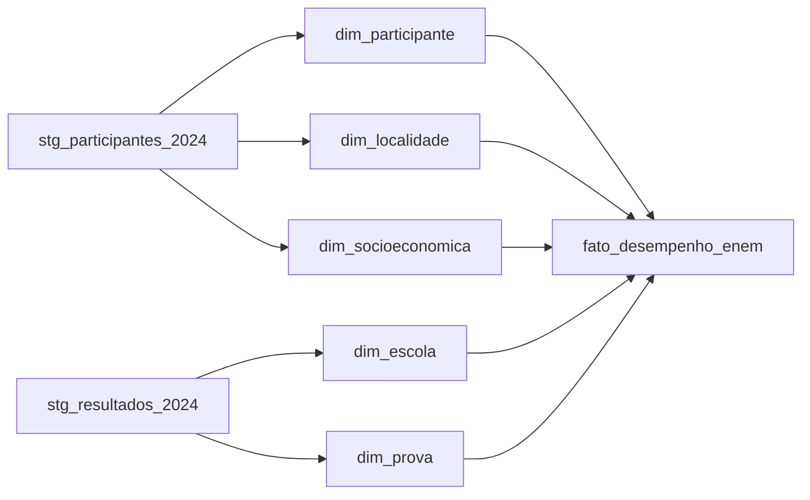

# Plano de Execução OLAP ENEM 2024

## Escopo

Usaremos os arquivos em [`h:/UNI7/SAD-Lina/AV2-TRABALHO-1-ENEM/microdados_enem_2024`](h:/UNI7/SAD-Lina/AV2-TRABALHO-1-ENEM/microdados_enem_2024), principalmente:

- [`DADOS/PARTICIPANTES_2024.csv`](h:/UNI7/SAD-Lina/AV2-TRABALHO-1-ENEM/microdados_enem_2024/DADOS/PARTICIPANTES_2024.csv): dados demográficos, localização da prova e respostas socioeconômicas.
- [`DADOS/RESULTADOS_2024.csv`](h:/UNI7/SAD-Lina/AV2-TRABALHO-1-ENEM/microdados_enem_2024/DADOS/RESULTADOS_2024.csv): presença, escola, provas e notas.
- [`INPUTS/INPUT_R_PARTICIPANTES_2024.R`](h:/UNI7/SAD-Lina/AV2-TRABALHO-1-ENEM/microdados_enem_2024/INPUTS/INPUT_R_PARTICIPANTES_2024.R) e [`INPUTS/INPUT_R_RESULTADOS_2024.R`](h:/UNI7/SAD-Lina/AV2-TRABALHO-1-ENEM/microdados_enem_2024/INPUTS/INPUT_R_RESULTADOS_2024.R): referência para rótulos/códigos das variáveis.
- Banco PostgreSQL local: `localhost`, base `ENEM2024`.
- Ferramenta de dashboard: Power BI.

## Estratégia OLAP

Criar uma área de staging para carregar os CSVs originais e, em seguida, transformar os dados em um esquema estrela voltado para análise de desempenho.

Modelo proposto:

Tabelas sugeridas:

- `stg_participantes_2024` e `stg_resultados_2024`: cópia bruta dos CSVs, preservando os códigos originais do INEP.
- `dim_participante`: faixa etária, sexo, raça/cor, estado civil, nacionalidade, conclusão do ensino médio e treineiro.
- `dim_localidade`: UF, região, município, capital/interior e códigos geográficos da prova.
- `dim_socioeconomica`: renda familiar (`Q007`), escolaridade dos pais (`Q001`, `Q002`), ocupação dos pais (`Q003`, `Q004`) e bens/serviços selecionados (`Q005` a `Q023`).
- `dim_escola`: tipo de escola, dependência administrativa, localização urbana/rural e situação de funcionamento.
- `dim_prova`: códigos das provas, língua estrangeira e situação de presença.
- `fato_desempenho_enem`: uma linha por inscrição, com medidas de notas: `NU_NOTA_CN`, `NU_NOTA_CH`, `NU_NOTA_LC`, `NU_NOTA_MT`, `NU_NOTA_REDACAO`, média geral e indicadores auxiliares.

## Transformações Principais

1. Validar estrutura e encoding dos CSVs, usando separador `;` e codificação compatível com os arquivos do INEP.
2. Criar scripts SQL para schemas `staging` e `olap` na base `ENEM2024`.
3. Carregar `PARTICIPANTES_2024.csv` e `RESULTADOS_2024.csv` no staging.
4. Criar dimensões com rótulos legíveis para os códigos do INEP, usando como base os scripts `INPUT_R_*`.
5. Derivar campos analíticos:
   - `regiao` a partir da UF.
   - `capital_interior` a partir do município/UF da prova.
   - `faixa_socioeconomica` a partir da renda familiar `Q007`.
   - `media_geral` a partir das áreas de conhecimento e redação.
6. Criar a tabela fato relacionando participante, localidade, socioeconomia, escola e prova.
7. Criar views ou consultas auxiliares para cada pergunta do dashboard.
8. Preparar conexão do Power BI ao PostgreSQL local e montar as páginas/visuais recomendados.
9. Produzir texto explicando o processo, justificativas do modelo e insights esperados.

## Perguntas do Dashboard

O modelo será preparado para responder diretamente às 10 perguntas do enunciado em [`AV2-TRABALHO-1-ENEM.md`](h:/UNI7/SAD-Lina/AV2-TRABALHO-1-ENEM/AV2-TRABALHO-1-ENEM.md):

- Média por Estado e Região: `fato_desempenho_enem` + `dim_localidade`.
- Média por faixa socioeconômica: fato + `dim_socioeconomica`.
- Maiores notas de redação por estado e município: fato + localidade.
- Maiores notas por área de conhecimento: fato + localidade + dimensões de perfil.
- Notas por gênero, renda, faixa etária e raça/cor: fato + participante + socioeconomia.
- Capitais versus interior: fato + localidade.
- Comparação por gênero e área de conhecimento: fato + participante.
- Escola pública versus privada por área: fato + escola.

## Entregáveis Esperados

- Scripts SQL de criação do staging, dimensões e fato.
- Scripts SQL de carga/transformação para popular o modelo OLAP no PostgreSQL `ENEM2024`.
- Views ou consultas analíticas para apoiar o Power BI.
- Orientação de conexão e estrutura sugerida do dashboard no Power BI.
- Documento final com processo de desenvolvimento, justificativas do modelo e principais insights.